# Faculty Recruitment Portal

Faculty Recruitment Portal is a web application developed using HTML, CSS, JavaScript, PHP, and MySQL. It provides a platform for managing faculty recruitment processes efficiently.

## Features

1. **Login and Signin Functionality**: Implemented using phpMailer for secure authentication.

2. **Dynamic Row Addition**: Allows dynamic addition of rows in certain tables, providing flexibility in data entry.

3. **Database Integration**: Data is stored in MySQL database tables corresponding to each page, ensuring organized data management.

4. **PDF Generation**: Utilizes DOMPDF for generating PDF documents, facilitating easy sharing and printing of important information.

5. **Docker Support**: Docker images have been successfully created, with Dockerfiles present in the `proj1` directory, enabling easy deployment and scalability.


## Docker run images samples 
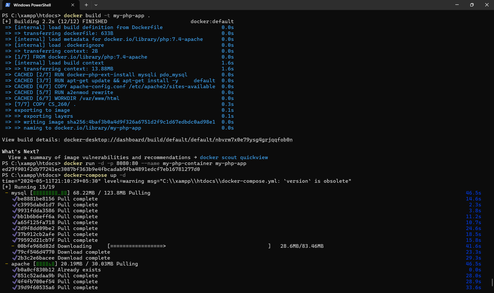


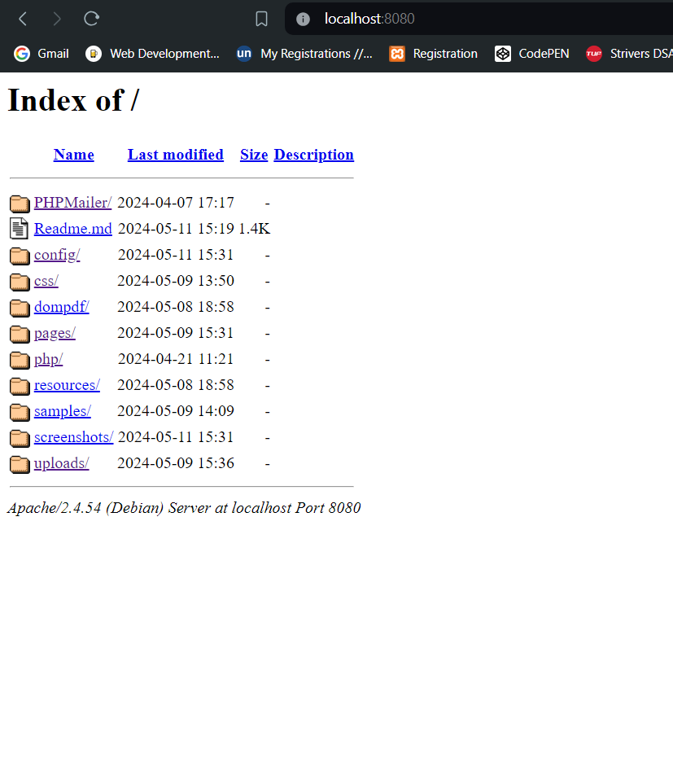

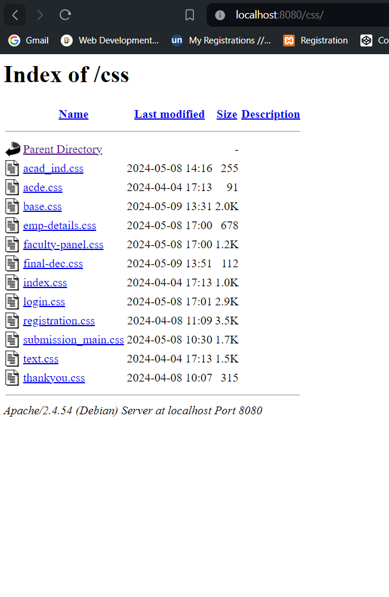

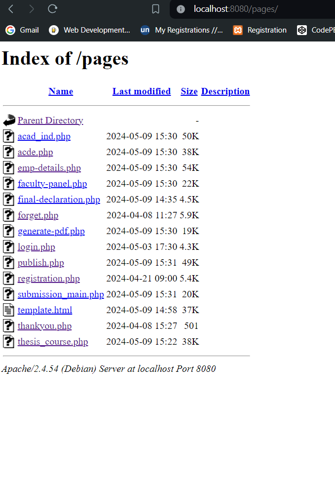

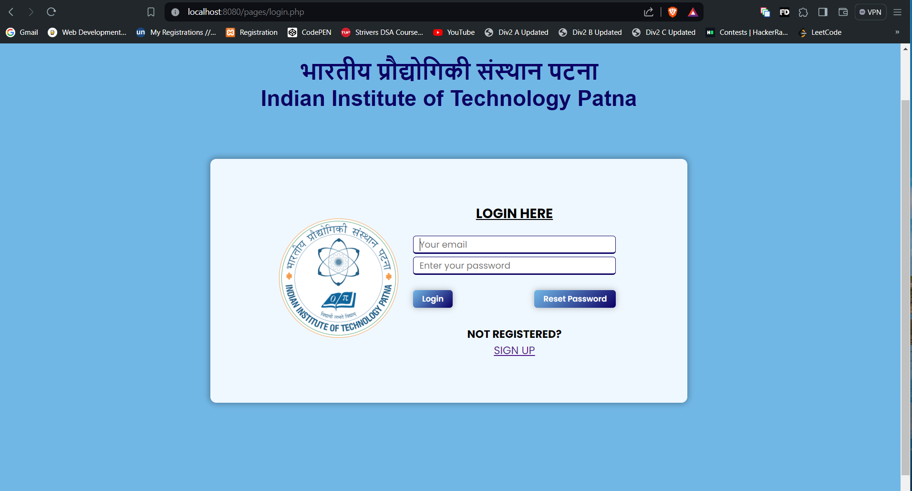

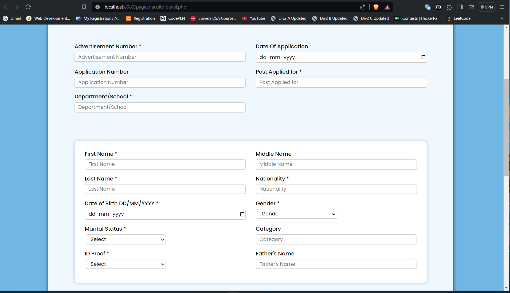


## Technologies Used

- **Frontend**: HTML, CSS, JavaScript
- **Backend**: PHP
- **Database**: MySQL
- **PDF Generation**: DOMPDF
- **Authentication**: phpMailer
- **Deployment**: Docker

## Usage

1. Clone the repository:

    ```
    git clone https://github.com/Ankit-git463/2201AI47_CS260.git
    ```

2. Set up the MySQL database and configure the connection in the PHP files.

3. Install dependencies using Composer (if applicable).

4. Run the application, ensuring Docker is set up properly if deploying using Docker.

## XAMPP RUN
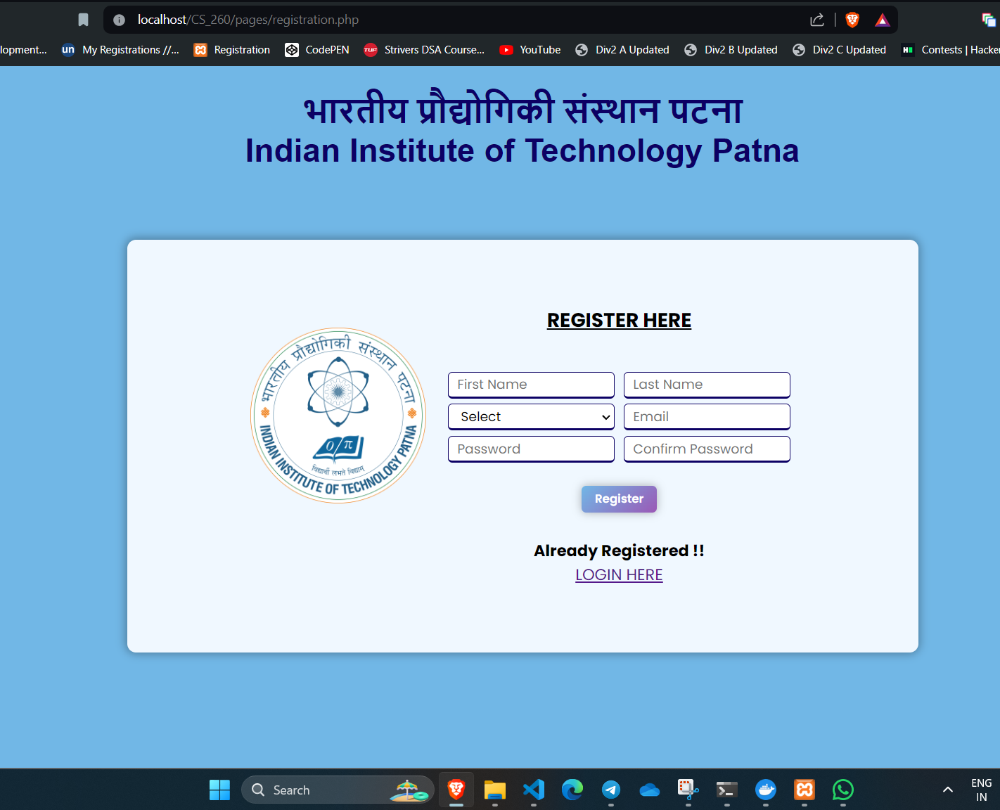

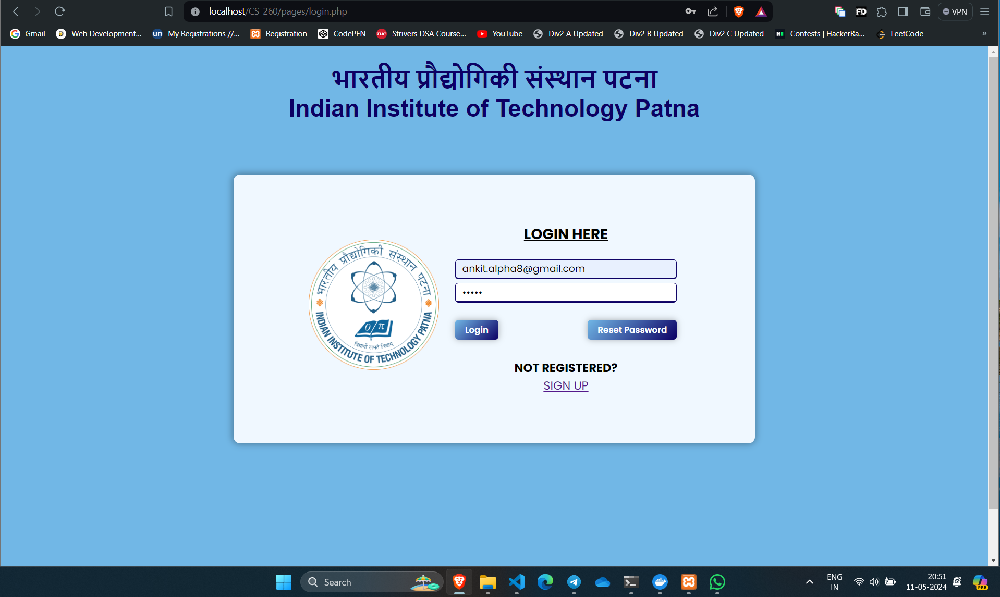

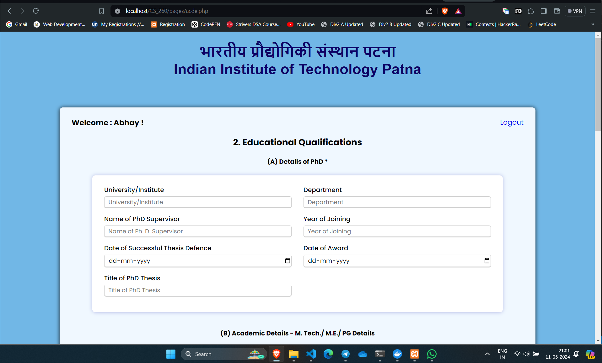

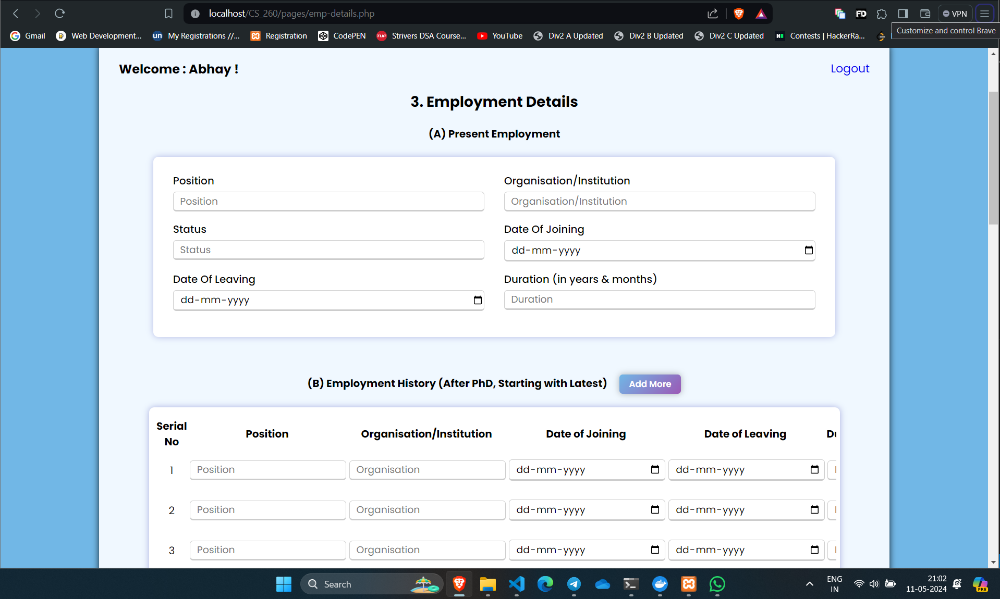

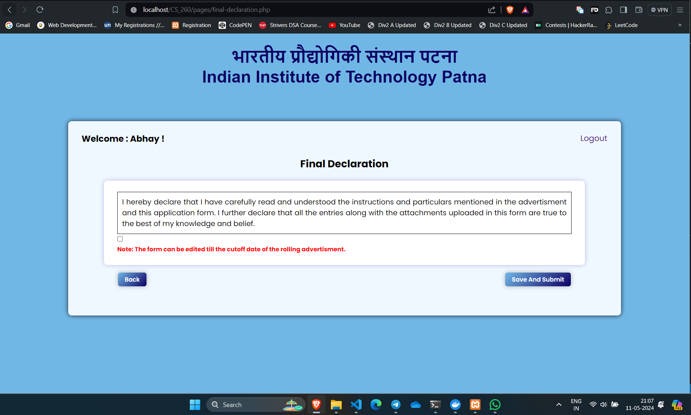

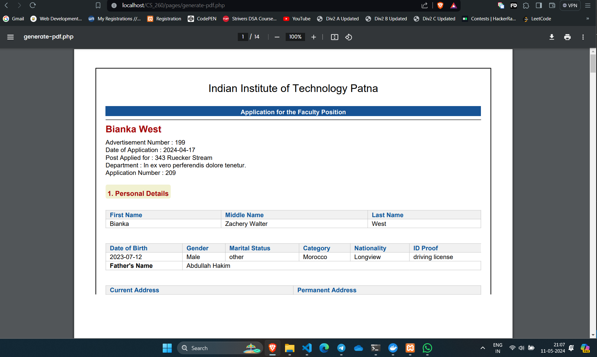


## Youtube link of the Video
    [Click Here TO Watch the Video](https://youtu.be/znlFqzg2ygI?si=0q2KhzNYYojpuPQ4)
